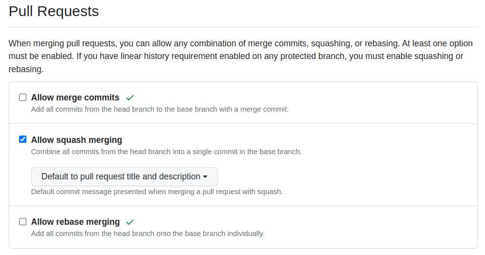

# Project Repository Setup
- [Overview](#overview)
- [Repository Naming](#repository-naming)
- [Branch Protection](#branch-protection)
- [Squash Merge](#squash-merge)
- [Branch Auto Deletion](#branch-auto-deletion)

## Overview
 이 문서에서는 [동아리 브랜치 관리 전략](https://github.com/ApptiveDev/.github/blob/main/docs/CONTRIBUTING.md#-%EB%B8%8C%EB%9E%9C%EC%B9%98-%EA%B4%80%EB%A6%AC-%EC%A0%84%EB%9E%B5)을 위한 리포지토리 세팅을 설명합니다. 

## Repository Naming
  
 동아리 리포지토리는 프로젝트명 및 `apptive`, 기수, 포지션을 드러내야 합니다.
 - **리포지토리명**: `프로젝트명-포지션`
    - `프로젝트명`의 대소문자 구분은 자유
    - `포지션`은 소문자로만 구성 (backend/frontend/android)
    - ex) PNU-backend, PNU-android, PNU-frontend 
 - **태그**: `apptive`와 기수

## Branch Protection
  
[Settings] > [Branches] > [Add rule]에서 `main` 브랜치에 대해 다음 두 가지를 설정합니다.
- [x] Require a pull request before merging
- [x] Require conversation resolution before merging

이제 main 브랜치에는 직접 커밋이 불가능하며, 코드리뷰를 모두 마친 Pull Request만으로 가능합니다.

## Squash Merge
  
[Settings] > [General] > [Pull Requests]에서 다음 두 가지를 설정합니다.
- `Allow squash merging`만 활성화
- `Default to pull request title and description` 선택 
  
앞으로 PR의 커밋들은 하나로 합쳐져서 병합되며 커밋 제목은 PR 제목으로 추가됩니다. 

## Branch Auto Deletion
  
[Settings] > [General] > [Pull Requests]에서 `Automatically delete head branches` 항목을 체크합니다.  
PR 병합 이후 해당 원격 브랜치는 자동으로 삭제됩니다.